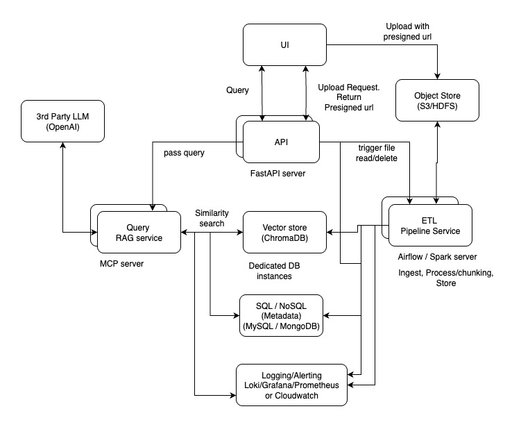

# ChatPDFDoc Retrieval-Augmented Generation (RAG) assistant
## Goal
The goal is to build a Retrieval-Augmented Generation (RAG) system to handle document ingestion, extract meaningful content, store it in structured formats, and make it queryable using LLMs.

live url: [https://chatpdfdoc-46sy.onrender.com](https://chatpdfdoc-46sy.onrender.com)

API docs: [https://chatpdfdoc-46sy.onrender.com/docs](https://chatpdfdoc-46sy.onrender.com/docs)


## How to setup the RAG system locally
- Clone the repository
```
git clone https://github.com/ayotomiwasalau/chatpdfdoc.git
cd chatpdfdoc
```

- Create a virtual environment
``` 
python3 -m venv .ragenv
```

- Activate the environment
``` 
chmod +x .ragenv/bin/activate
source .ragenv/bin/activate
```

 - export LLM key (OpenAI)
```
export OPENAI_API_KEY="api_key"
```

- Install dependencies
```
python -m pip install --upgrade pip setuptools wheel
python -m pip install -r requirements.txt
```

- Start the app
```
python main.py
```
or
```
python -m uvicorn main:app --reload
```

- Run the unit tests
```
python -m pytest
```

## Design
For design consideration, on a high level we have 3 core services
- The backend API service for handling and directing request and response
- The pipeline service for handling ingesting, processing and storing chunked data
- The LLM Query service for calling 3rd party LLM APIs with retrieved data chunks to augment requests

### Current MVP design implementation


In this repo, we have a single server instance running all the core service. 
- `FastAPI` was used for the API service, it receives the file and passes it to the `Pipeline` module which store the output in the vector DB after processing.
- The vector store used is `Chroma DB`, and `OpenAI embeddings` was used to convert the documents to vector representations, so that similarity match can be executed. Chroma DB is a good choice because it is tested and trusted, it also integrates into a large number of ML tooling and has a sizable ecosystem.
- Once the client sends a query, the API receives it and passes to the `Query` module. This module runs a similarity match against the vector store to get chunks of data relevant to the query.
- The query is augmented and passed to the foundation LLM (OpenAI) so that the response is gotten and passed along to the client. An actual API call was made to the LLM not mocked.
- The system also integrated unit tests and continous integration and deployment for smoother updates and changes.

### Production level design implementation 



To build a production grade RAG system that would be scalable and resilient, we need to decouple the system. This involve each module running independently on their own server and specialied tools being applied to handle distributed processing
- For the backend API, FastAPI is still suitable for large scale REST requests and responses, we can have multiple instance on different server for redundancy
- The file object received from the user will be stored in an object storage like `S3` or `HDFS`, this allow the system to store the large number of raw document file for the user, object storage have the ability to store data at scale on cheap commodity hardware.
- The Pipeline module would be refactored to use tools like `Airflow` or `Apache Spark`. The tools can handle distributed processing, they can run tasks in parrallel making them very efficient. The pipeline would be equipped to handle batch transaction and trigger based uploads
- The vector store can still use Chroma DB, we can connect to a cloud instance that would store the data distributedly and partition appropriately
- For faster retrival, we can batch query together, create indexes, partition data by tenants, use knowledge graph to organize information and also we can cache the hottest queries so there wont be need to frequently query the DB. Alot of DB providers offer these solutions out of the box for the users.
- We can further have an SQL or NoSQL DB for metadata, so we can scale the vector data and the metadata separately and possibly cheaply. We can also run analytics conveniently on the metadata store
- There is also need for logging and monitoring. The modules will be set up in a way to send logs and metrics data to the available loggin system. Notable open source logging/monitoring system include Loki, Prometheus and Grafana or ELK stack, alternative depending on cloud provider, for example AWS provides Cloud watch for logging, monitoring and alerting.
- Then for the language model, there are many 3rd party LLM services that can be used, OpenAi or Anthropic are two I recommend. However Gemini is alot cheaper but less consistent. Overall there MCP tools that make connecting to LLMs easy and straight forward

### Code architecture


The code was designed with extensibility in mind. Each modules handles a single reponsibility, this avoids overlapping or duplicate functions and overcomplicating the code base and its functionality. Furthermore, dependency inversion approach was applied, such that the lower level modules can easily be swapped or update with another without changing alot of files or disrupting the operations of higher level modules. This will make the code maintainable over a long period of time.


