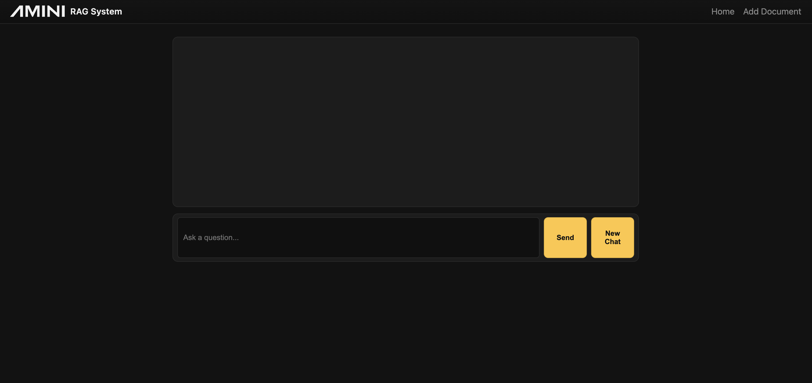
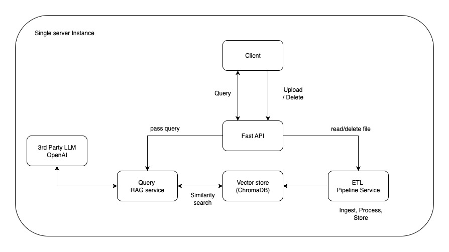
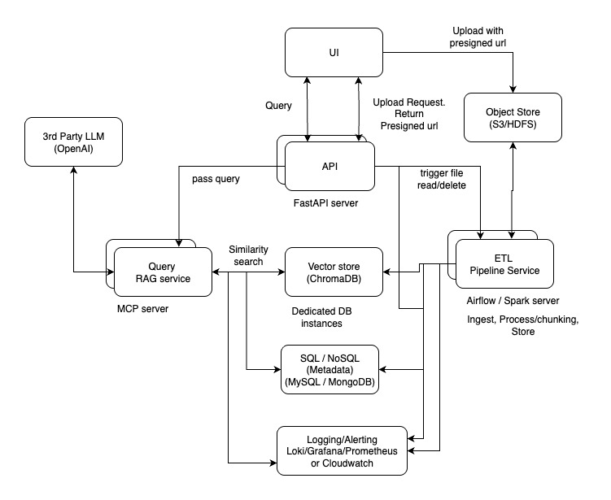

# Amini Retrieval-Augmented Generation (RAG) assistant
## Goal
The goal is to build a Retrieval-Augmented Generation (RAG) system to handle document ingestion, extract meaningful content, store it in structured formats, and make it queryable using LLMs.

live url: []()
API docs:



## How to setup the RAG system locally
- Create a virtual environment
``` 
python3 -m venv .ragenv
```

- Activate the environment
``` 
chmod +x .ragenv/bin/activate
source .ragenv/bin/activate
```

 - export LLM key (OpenAI)
```
export OPENAI_API_KEY="api_key"
```

- Install dependencies
```
python -m pip install --upgrade pip setuptools wheel
python -m pip install -r requirement.txt
```

- Start the app
```
python main.py
```
or
```
python -m uvicorn main:app --reload
```

- Run the unit tests
```
python -m pytest
```

## Design
For design consideration 
0n a high level we have 3 core services
- The backend API service for handling and directing request and response
- The pipeline service for handling ingesting, processing and storing chunked data
- The LLM Query service for calling 3rd party LLM APIs with retrieved data chunks to augment requests

### Current MVP implementation


In this repo, we have a single server instance running all the core service. 
- `FastAPI` was used for the API service, it receives the file and passes it to the `Pipeline` module which store the output in the vector DB after processing.
- The vector store used is `Chroma DB`, and `OpenAI embeddings` was used to convert the documents to vector representations, so that similarity match can be executed
- Once the client send a query, the API receives it and passes to the `Query` module. This module handles runs a simialrity match agains the vector store to get chunks of data releveant to the query.
- The query is augmented and passed to the foundation LLM (OpenAI) so that the response is gotten and passed along to the client


### Production level implementation 

To build a production grade RAG system that would be scalable and resilient, we need to decouple the system. This involve each module running independently on their own server and specialied tools being applied to handle distributed processing
- For the backend API, FastAPI is still suitable for large scale handling of REST request and response, we can have multiple instance on different server for redundancy
- The file object received from the user will be stored in an object storage like `S3` or `HDFS`, this allow the system to store the large number of raw document file for the user, object storage have the ability to store data at scale on cheap commodity hardware.
- The Pipeline module would be refactored to use tools like Airflow or Apache Spark. The tools can handle distributed processing, they can run tasks in parrallel making them very efficient
- The vector store can still Chroma DB, we can connect to a cloud instance that would store the data distributed and partition appropriately
- Index and caching 


improvement


Reason

### code architecture
[](./images/code-arch.jpg)
singel responsibility
dependency inversion


Handling thousands of documents in parallel.
Using orchestration tools (e.g., Airflow) for scheduling/monitoring.
Integrating with cloud storage & warehouses (AWS S3, Redshift, BigQuery, etc.).
Exposing the query system via an API (e.g., FastAPI).

What you actually implemented vs. what you mocked.
Setup instructions so we can run your solution locally.
Improvements you’d make with more time (e.g., embeddings, knowledge graph, caching).
The reasoning behind your technical decisions.

Data engineering best practices → Thoughtful ETL/pipeline design, scalability, reproducibility.
Architecture thinking → Ability to explain design choices and extensions.


